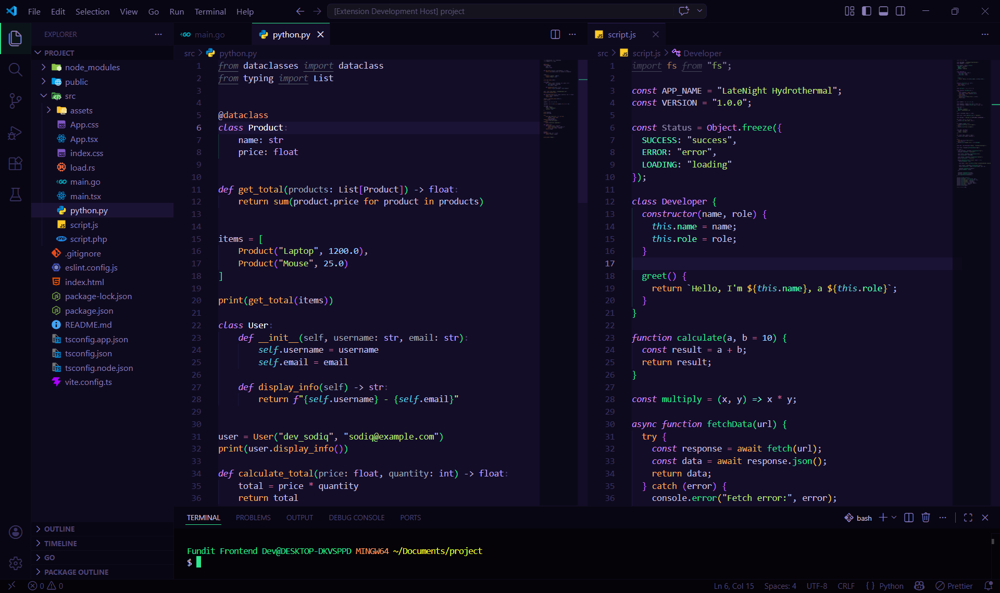

# 🌙 LateNight

> **Code longer. Strain less.**

A dark theme designed for long coding sessions with minimal eye strain and smooth visual balance.

---



# 🚀 How to Use This Theme in VS Code (Step-by-Step)

## 1. Install the Theme

### Option A — From VS Code Marketplace
1. Open **Visual Studio Code**
2. Go to **Extensions** (`Ctrl + Shift + X`)
3. Search for: **LateNight**
4. Click **Install**

---

### Option B — Manual Installation (VSIX)
1. Download the `.vsix` file  
2. Open VS Code  
3. Press `Ctrl + Shift + P`  
4. Type: **Extensions: Install from VSIX**
5. Select the downloaded file

---

## 2. Apply the Theme

1. Press `Ctrl + Shift + P`
2. Type: **Color Theme**
3. Select: **LateNight**

✅ Your editor will instantly switch to the theme

---

## 3. (Optional) Set as Default Theme

1. Open **Settings** (`Ctrl + ,`)
2. Search for: `color theme`
3. Set:

```json
"workbench.colorTheme": "LateNight"